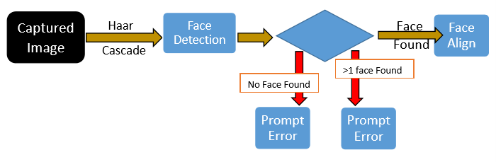
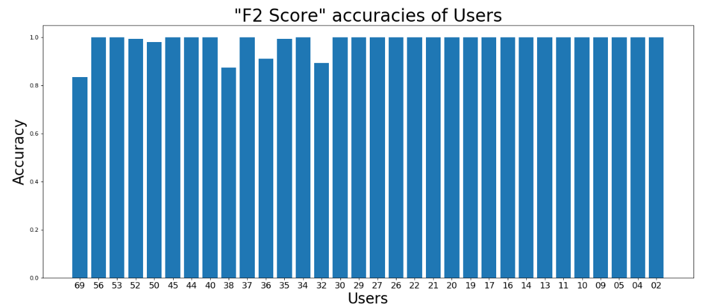
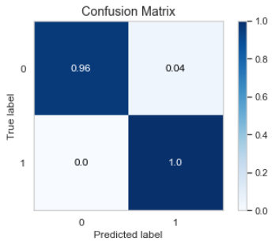
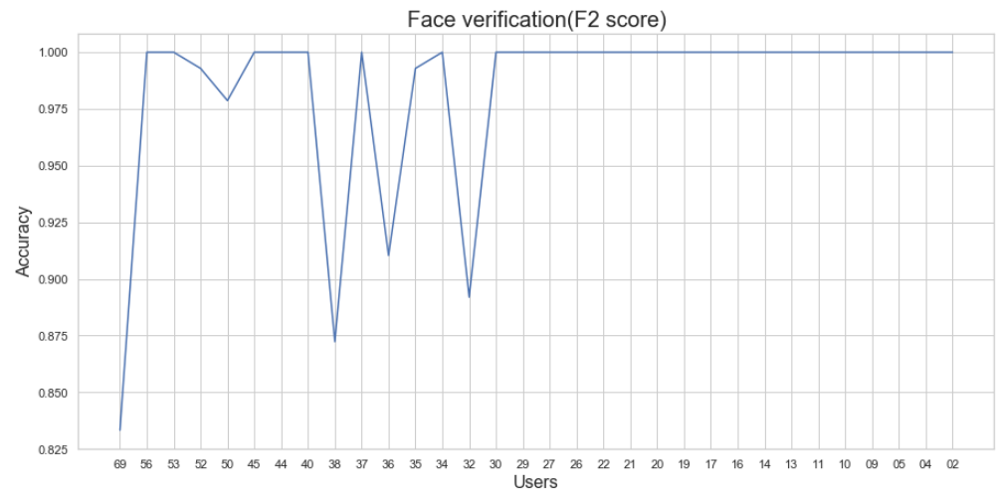

# Face-Verification-based-on-Similarity-Check
Similarity based Verification of faces with facenet model

# Project Flow
  1) Face Detection and crop
  2) Face Alignment
  3) Get Embeddings
## 1)Face Detection and Crop
   
   
**Used:** 
  * **haarcascade_frontalface_default.xml** (for detecting faces) 
**Process Flow:** 
  * Captured image given as Input. 
  * Detect Faces in the **Captured Image** with “haarcascade_frontalface_default.xml”.
  * Prompt Errors. 
    * If faces are **not found** or  **more than one face** found 
  * Crop Detected image and Send that image to **face Alignment** phase. 
  
## 2) Face Alignment
   
   
**Used:** 
  * **shape_predictor_68_face_landmarks.dat** (for finding face landmarks on a image) 
**Process Flow:** 
  * Cropped image from **FaceDetection&Crop** is given as input.
  * Extract the ROI of the **original** face, then align the face using facial landmarks. 
  * Aligned face is given to Get Embeddings phase.  
  
## 3) Get Embeddings
   
   
**Used:** 
  * *facenet Pre-trained Model* (for getting embeddings of a face)—it is a weights model 
**Process Flow:** 
  * Aligned Face is given as input. 
  * Create Tensorflow graphs for **Retraining the FC layer**(Fully connected layer) for the given image. 
  * Prewhiten the given Image 
  * Pass the given image through FC Layer to get **128 Dimensional Vector(Embeddings)** 
  * Return Embeddings. 
    * Store them If it Registration Process 
    * For Login Process, Directly Use them For Prediction.

# Results
* **total Users** -> 32
* one user has around 10 images (Refer faceVerification.ipynb)
* calculated **f2-score**
    * 
    
* Confusion matrix
    * 
   
* Overall matrics(f2-score)
    * 
 
